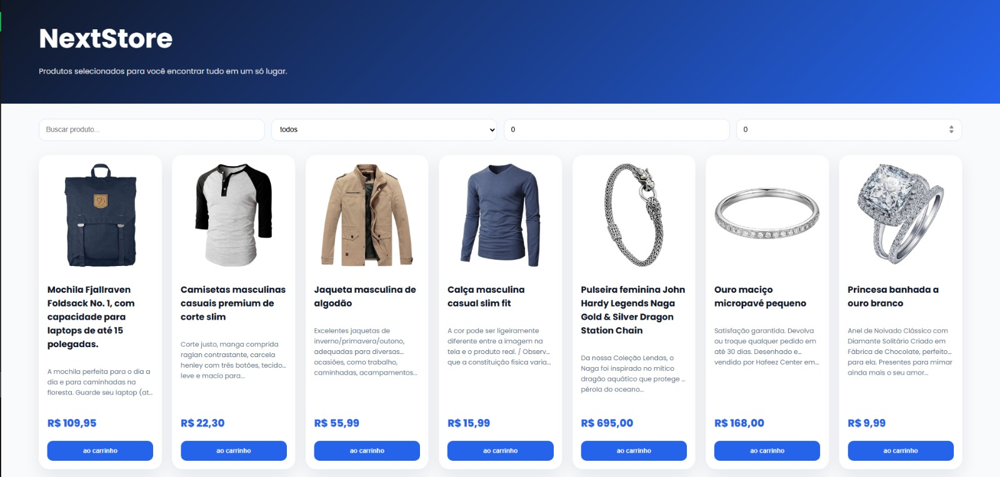
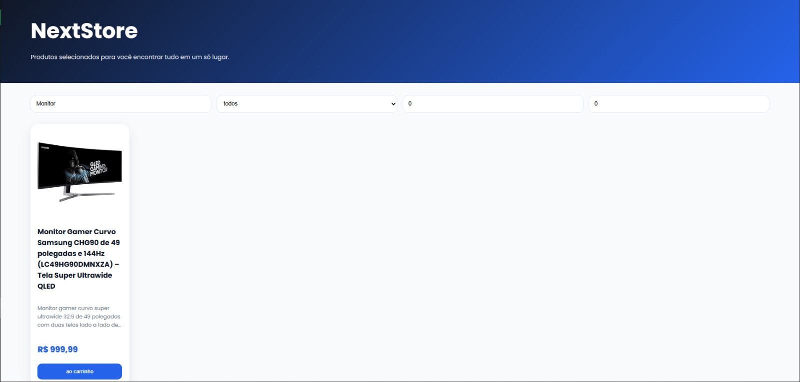

# 🛒 NexStore

Aplicação web de e-commerce desenvolvida com **React e TypeScript**, integrada à **Fake Store API** para consulta e exibição dinâmica de produtos.

O projeto foi desenvolvido com foco na prática de desenvolvimento Front-end, consumo de APIs REST, componentização, tipagem com TypeScript e implementação de funcionalidades de catálogo e carrinho.

---

## 🎯 Objetivo

O objetivo do projeto é desenvolver uma aplicação de e-commerce capaz de consumir dados de produtos de uma API externa e disponibilizá-los de forma dinâmica para o usuário.

A aplicação permite pesquisar produtos, filtrar por categoria e definir uma faixa de preço, além de possibilitar a adição de produtos ao carrinho.

---
## 📸 Screenshots

### 🏠 Página inicial

Interface principal da NexStore, apresentando o catálogo de produtos e os principais elementos de navegação da aplicação.



---

### 🔎 Pesquisa e filtros

Pesquisa funcional da NexStore, permitindo localizar produtos e utilizar filtros para refinar os resultados por categoria e faixa de preço.



---

## ✨ Funcionalidades

- 📦 Consulta de produtos através da Fake Store API
- 🔎 Pesquisa de produtos por nome
- 🏷️ Filtro por categoria
- 💰 Filtro por preço mínimo e máximo
- 🛒 Adição de produtos ao carrinho
- 🔢 Controle da quantidade de produtos adicionados
- ⏳ Indicador de carregamento durante a consulta da API
- 📱 Interface preparada para diferentes tamanhos de tela

---

## 🛠️ Tecnologias

- **React** — construção da interface e componentes
- **TypeScript** — tipagem estática e maior segurança no desenvolvimento
- **Vite** — ferramenta de build e desenvolvimento
- **Fake Store API** — fornecimento dos dados dos produtos
- **REST API** — comunicação com serviço externo
- **ESLint** — padronização e análise do código
- **Git/GitHub** — versionamento e gerenciamento do projeto

---

## 🧩 Estrutura do projeto

```text
src/
├── components/
│   ├── ProductCard.tsx
│   └── ProductList.tsx
│
├── hooks/
│   └── useProducts.ts
│
├── pages/
│   └── CatalogPage.tsx
│
├── services/
│   └── products.ts
│
├── types/
│   ├── cartItem.ts
│   └── product.ts
│
├── App.tsx
├── Button.tsx
├── main.tsx
└── OlaNexstore.tsx